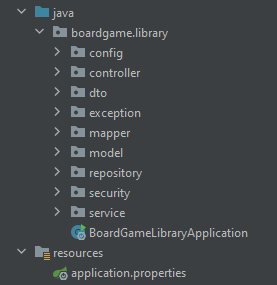
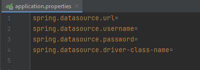

## 🎲BoardGame Explorer🎲

BoardGame Explorer is an application that represents a library of board games. Users have the opportunity to browse the available games, read reviews, register, fill the cart, and reserve certain game sets for a specific time. Administrators can also adjust the collection of games, add, delete, and update them.

## Features
This API provides HTTP endpoint`s and tools for the following
- Create a board game:` POST/http://localhost:8080/boardgames `
- Update board game:` PUT/http://localhost:8080/boardgames `
- Find board game by title: `GET/http://localhost:8080/boardgames/by-title `
- Register a user` POST/http://localhost:8080/auth/register `
- Login a user` POST/http://localhost:8080/auth/login`
- Get cart items: ` GET/http://localhost:8080/cart`
- Delete cart item: ` DELETE/http://localhost:8080/cart/cart-items/{id}`
- Get reviews by board game id: ` GET/http://localhost:8080/boardgames/{boardGameId}/reviews`
- Place an reservation: ` POST/http://localhost:8080/reservations`

## Project structure

The project includes the following elements:

**config**: Configuration files
**controllers**: Controllers for authentication, viewing table games, making reservations
**repository**: Classes for accessing database tables
**dto**: Models of objects that the user interacts with
**exceptions**: There are custom exceptions
**mapper**: Interfaces for dto mapping
**model**: Includes User, Board Game, Reservation, Cart models
**service**: Provides multi-tiered architecture
**security**: Contains AuthenticationService and JWT token validation

## Technologies:

1. Spring Core
2. Spring MVC
3. Spring Security
4. Spring Boot
5. Spring Data JPA
6. Hibernate
7. Maven
8. MySQL

## How to start a project

To run this application, you need to install the following software:

- Tomcat 9.0.50
- MySQL 8.0.31

First of all, you need to connect the database to the project, for this you need to enter your data in the resources/**application.properties**

Then you should select the appropriate Tomcat configuration and click **"Run"** or use a combination **Shift + F10**
 